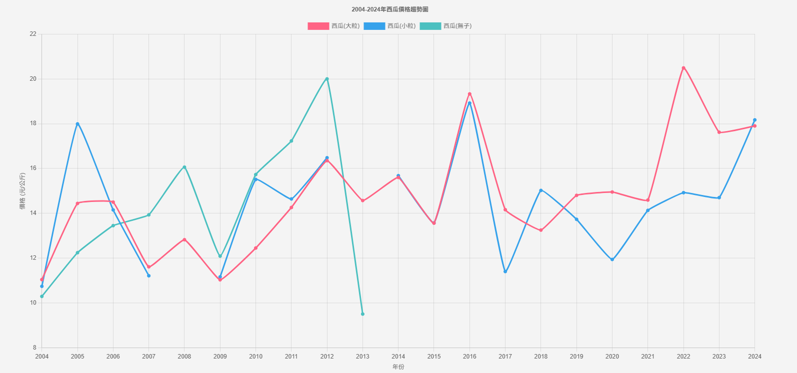
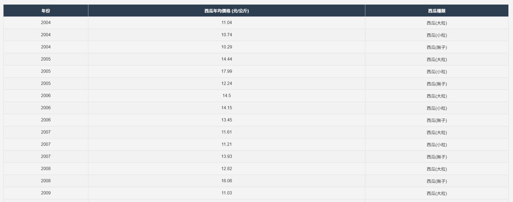
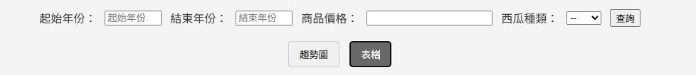
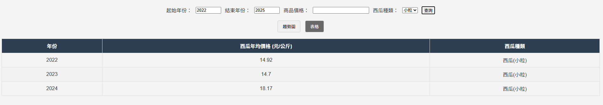
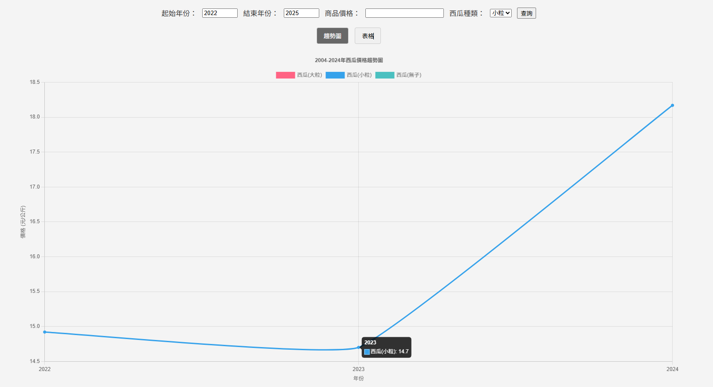

# 通貨膨脹-你關心缺蛋嗎?

## 1. API 串接

### 1.1 取得所有西瓜價格資料

- **路徑**：`GET /api`
- **說明**：回傳所有年份、所有種類的西瓜價格資料
- **用途**：前端載入時顯示所有資料的表格，或透過元件繪製圖表




### 1.2 條件查詢西瓜價格資料

- **路徑**：`GET /api/search`
- **參數**：

  - `startYear`（可選）：起始年份
  - `endYear`（可選）：結束年份
  - `price`（可選）：價格篩選
  - `type`（可選）：西瓜種類

  

- **說明**：根據查詢條件回傳對應的西瓜價格資料




- **用途**：前端查詢利用 js 送出表單 (request GET)，'api/search' 路由抓取 get 接收表單處理，回傳 (response) 抓到的資料 ( json 格式 ) 給 index.js，再透過新增 html 元素，依條件顯示結果

## 2. DataBase 建立

### 2.1 資料表：`users`

| 欄位名稱 | 型別    | 說明           |
| -------- | ------- | -------------- |
| id       | INTEGER | 主鍵，自動遞增 |
| date     | INTEGER | 年份           |
| price    | REAL    | 年均價格       |
| name     | TEXT    | 西瓜種類       |

### 2.2 建立方式

在 `database.js` 中，先執行檔案建立資料庫與資料表，並插入預設資料（如 2004~2024 年各種西瓜價格）

```javascript
const sqlite3 = require("sqlite3").verbose();
const db = new sqlite3.Database("./db/database.sqlite");

db.serialize(() => {
  db.run(`
    CREATE TABLE IF NOT EXISTS users (
      id INTEGER PRIMARY KEY AUTOINCREMENT,
      date INTEGER,
      price REAL,
      name TEXT
    )
  `);
  // ...插入預設資料...
});
```

## 3. 前端串接流程

1. 頁面載入時，呼叫 `GET /api` 取得所有資料
2. 使用者透過查詢表單選擇條件，送出後呼叫 `GET /api/search` 取得篩選結果
3. 前端將取得的資料以圖表與表格方式呈現

## 4. API 串接範例

### 4.1 取得所有資料

```javascript
fetch("/api")
  .then((response) => response.json())
  .then((data) => {
    //繪製圖表或表格
    renderChart(data);
    renderTable(data);
  });
```

### 4.2 條件查詢資料

```javascript
function searchWatermelon(startYear, endYear, price, type) {
  const params = new URLSearchParams({
    startYear,
    endYear,
    price,
    type,
  });
  fetch(`/api/search?${params.toString()}`)
    .then((response) => response.json())
    .then((data) => {
      // 根據查詢結果重繪製表格
      renderChart(data);
      renderTable(data);
    });
}
```

## 5. 資料庫操作範例

### 5.1 查詢所有資料

```javascript
app.get("/api", (req, res) => {
  db.all("SELECT * FROM users", (err, rows) => {
    if (err) return res.status(500).json({ error: err.message });
    res.json(rows);
  });
});
```

### 5.2 條件查詢

```javascript
app.get("/api/search", (req, res) => {
  const { startYear, endYear, price, type } = req.query;
  let sql = "SELECT * FROM users WHERE 1=1";
  const params = [];
  if (startYear) {
    sql += " AND date >= ?";
    params.push(startYear);
  }
  if (endYear) {
    sql += " AND date <= ?";
    params.push(endYear);
  }
  if (price) {
    sql += " AND price <= ?";
    params.push(price);
  }
  if (type) {
    sql += " AND name = ?";
    params.push(type);
  }
  db.all(sql, params, (err, rows) => {
    if (err) return res.status(500).json({ error: err.message });
    res.json(rows);
  });
});
```

## 6. 小結

- 前端透過 fetch 串接 `/api` 與 `/api/search` 取得資料
- 後端以 SQLite3 儲存與查詢資料，並提供 GET 方法 API
- 所有資料查詢皆由後端 API 處理，前端負責顯示
